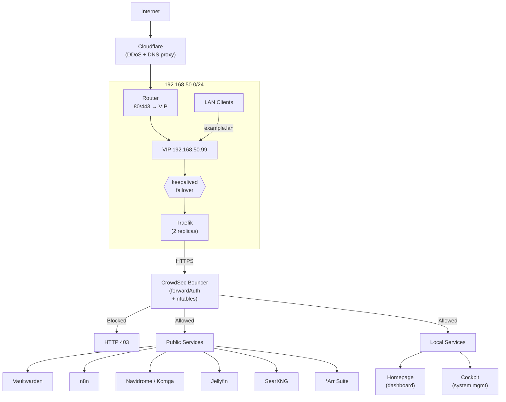
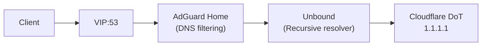
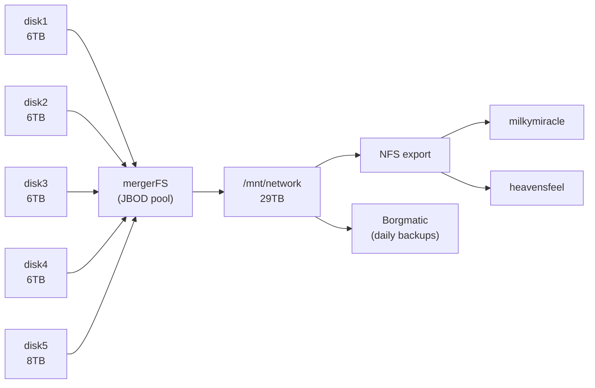

# Homelab Infrastructure

Three-node Docker Swarm cluster running Ubuntu 24.04. Services deployed via `docker compose` (standalone) and `docker stack deploy` (swarm). All infrastructure is defined as code — secrets excluded.

[](LICENSE)

---

## Cluster Topology

| Node | IP | Specs | Role | Key Services |
|------|----|-------|------|-------------|
| **milis-wonderspace** | 192.168.50.115 | i7-7700, 16GB, 29TB pool | Storage, Downloads | *Arr suite, Navidrome, Vaultwarden, Komga |
| **milkymiracle** | 192.168.50.122 | i5-9500T, 16GB, UHD 630 | Compute, Media, Proxy | Jellyfin (HW transcode), Traefik, Foundry VTT, CrowdSec LAPI |
| **heavensfeel** | 192.168.50.129 | N95, 16GB, 512GB SSD | Monitoring, Automation | Grafana, Prometheus, Loki, Vaultwarden, n8n, SearXNG |

---

## Architecture



### DNS Chain



AdGuard Home runs as a Swarm global service on all 3 nodes. The keepalived VIP floats to the healthiest node, carrying the DNS + Traefik endpoints with it.

See `docs/architecture/overview.md` for a detailed traffic flow breakdown, and `docs/network/topology.md` for subnet layout and firewall details.

### Storage Architecture



---

## Directory Structure

```
homelab-iac/
├── compose/                  # Docker Compose definitions
│   ├── nodes/                #   Per-node standalone compose files
│   ├── stacks/               #   Swarm stack files (traefik, infra, cockpit)
│   └── apps/                 #   App-specific compose files (searxng, job-ops)
├── traefik/                  # Traefik reverse proxy config
│   ├── traefik.yml           #   Static config (ACME, providers, entrypoints)
│   └── dynamic/              #   Dynamic configs (routers, middlewares)
├── monitoring/               # Observability stack
│   ├── prometheus/           #   Scrape configuration
│   ├── promtail/             #   Log shipping configuration
│   ├── grafana/              #   Provisioning (datasources, dashboards)
│   │   └── provisioning/
│   └── dashboards/           #   Grafana dashboard JSON definitions
├── network/                  # Network topology & configuration
│   └── keepalived/           #   VIP failover config (per-node + health check)
├── scripts/                  # Operational scripts + systemd units
├── docs/                     # Documentation
│   ├── architecture/         #   System architecture overview
│   ├── network/              #   Network topology & subnets
│   ├── monitoring/           #   Monitoring stack details
│   ├── storage/              #   Storage layout & drive health
│   ├── servers/              #   Per-node hardware & service profiles
│   ├── services/             #   Service deep-dives
│   └── flows/                #   Data flow diagrams
├── .env.example              # All required environment variables
├── LICENSE                   # MIT License
└── README.md
```

---

## Design Decisions

### Docker Swarm over Kubernetes

Kubernetes is an industry standard, but for a 3-node **homelab** it adds unnecessary complexity. Swarm provides:
- Native Docker Compose support (no YAML translation)
- Built-in service discovery and load balancing
- Simpler TLS certificate management
- Lower resource overhead (no etcd, no kubelet on every node)

For a homelab, this is completely acceptable — actually pretty preferred. Set and forget, widely supported (it's still just running docker), architecture is simpler, bada-bing bada-boom.

### Traefik

Traefik's file provider + Docker provider combo is ideal for mixed Swarm/standalone deployments, we don't need Swarm for everything and we've stuck with it since the Homelab began. Automatic Let's Encrypt via Cloudflare DNS-01 challenge handles wildcard certificates. CrowdSec bouncer integrates as a forwardAuth middleware for WAF. There's an argument to be made about transferring to Caddy or another Reverse Proxy Manager if we're not using auto-discovery, but nothing about Traefik is necessarily *broken* to warrant replacing it.

### NFS over alternatives

Ceph, GlusterFS, and Longhorn are overkill. NFS v4 with mergerFS on the storage node provides:
- Simple JBOD pool management (no RAID overhead)
- Easy disk addition/replacement (just add/remove from mergerFS)
- Direct access to files from any node

The main downside here is that NFS is our single-point-of-failure, mitigated by the stale-mount detection and recovery scripts, but still SPoF. Under ideal circumstances, the JBOD is connected directly to each node, but that's not feasible currently and would degrade performance significantly due to the enclosure's forced BOT protocol... which is a whole other mess I'm going to talk about.

### USB Enclosures VS Functional Design

I'm going to be straight with you. This sucks. I'm currently using a [Yottamaster PS500RU3](https://www.amazon.com/dp/B0BP2CBR85?ref=ppx_yo2ov_dt_b_fed_asin_title&th=1) after one of my ORICO Hard Drive enclosures died. It works, that's all it really has to do, but from a design principle this is unideal and if you're using me as a boilerplate to build from scratch, do **not** do this. My Homelab nodes have several drawbacks that prevent me from utilizing other methods, notably, native SATA/SAS, see my [USB Migration](/docs/storage/USB%20Migration.md) document.

The goal is to get it to work and for what I'm doing with it I don't really need super powerful or fast drives, it's fine, but it is one of my bigger regrets not planning ahead for.
### mergerFS over ZFS/btrfs/RAID

mergerFS gives JBOD with no striping and no parity overhead. This is acceptable because:
- Content is replaceable (downloads, media files)
- Critical data (configs, passwords) is backed up elsewhere
- Disks are USB-attached and hot-swappable

In an ideal world, we do use RAID, but this procedure requires us to wipe our existing disks and regain all of our content for minimal performance gain, or really even reliability. Our USB enclosure does support RAID, but it's locked to that vender's RAID, and we'd be stuck forever in that enclosure. Booooooo. No good. Software RAID is certainly an option, but see the first point. 

## Servers

| Node | Docs | Role |
|------|------|------|
| **milis-wonderspace** | `docs/servers/milis-wonderspace.md` | Storage, Downloads, *Arr suite, Vaultwarden |
| **milkymiracle** | `docs/servers/milkymiracle.md` | Traefik, Jellyfin, CrowdSec, Foundry VTT |
| **heavensfeel** | `docs/servers/heavensfeel.md` | Grafana, Prometheus, Loki, SearXNG, n8n |

### Per-node compose files over a single mega-file

Each node runs a focused set of services with different resource requirements. Per-node files:
- Match the actual deploy workflow
- Make it obvious what runs where
- Allow independent restarts and updates
- Avoid a single massive YAML file with conditional logic

---

## Security

| Layer | Technology | Notes |
|-------|-----------|-------|
| WAF | CrowdSec + Traefik Bouncer | forwardAuth middleware, rate limiting, 57+ detection scenarios |
| Network | keepalived VIP | Floating IP for HA DNS + Traefik |
| Firewall | nftables via CrowdSec bouncer | Blocks at OS level on all 3 nodes |
| Network isolation | VPN gateway | Select services with routed traffic |
| TLS | Let's Encrypt (DNS-01) | Wildcard certs via Cloudflare API |
| Secrets | Docker Swarm secrets | cf_dns_api_token, .env, separate secret files |

CrowdSec is the backbone of the security posture. It runs on all 3 nodes with:
- A central LAPI on milkymiracle aggregating decisions
- A Traefik bouncer in the forwardAuth middleware chain
- nftables firewall bouncers on each node for network-level blocking
- Community blocklist with 18k+ known malicious IPs

---

## Monitoring

Prometheus + Loki + Grafana stack on heavensfeel:

- **node_exporter**: CPU, RAM, disk, network per node (Swarm global)
- **cAdvisor**: Per-container metrics (Swarm global)
- **Docker engine metrics**: Container state counts (port 9323 on each node)
- **Promtail**: Container log shipping to Loki (Swarm global)
- **Grafana**: Dashboards with hostname-based filtering

Dashboards auto-provision from `monitoring/dashboards/`:
- **Homelab Overview**: CPU, memory, disk, network timeseries per node
- **Homelab Drilldown**: Per-container CPU/memory, Loki log stream, restart annotations

---

## Scripts

| Script | Function | Runs As | Trigger |
|--------|----------|---------|---------|
| `smart-health-check.sh` | Weekly SMART health checks on storage drives | root (systemd) | `smart-health-check.service` / `.timer` (weekly) |
| `cleanup-stale-mounts.sh` | Force-unmount stale USB mount points | root (systemd) | `cleanup-stale-mounts.service` (manual) |
| `detect-stale-network.sh` | Detect and recover stale NFS/mergerFS mounts | root (systemd) | `detect-stale-network.timer` (10 min) |
| `searxng-entrypoint.sh` | Merge custom bangs into SearXNG at startup | container | On container start |
| `merge-homelab-bangs.py` | Inject custom search bangs into SearXNG trie | container | Via entrypoint |
| `homelab-scripts.polkit` | Polkit rules to run scripts without sudo | — | Installed to `/usr/share/polkit-1/rules.d/` |

All admin scripts (`smart-*`, `cleanup-*`, `detect-*`) run as root via systemd oneshot services. The homelab user invokes them with `systemctl start <service>` — no sudo needed thanks to the polkit rules in `homelab-scripts.polkit`.

---

## Lessons Learned

See the companion repository for detailed incident postmortems.

---

## License

MIT
